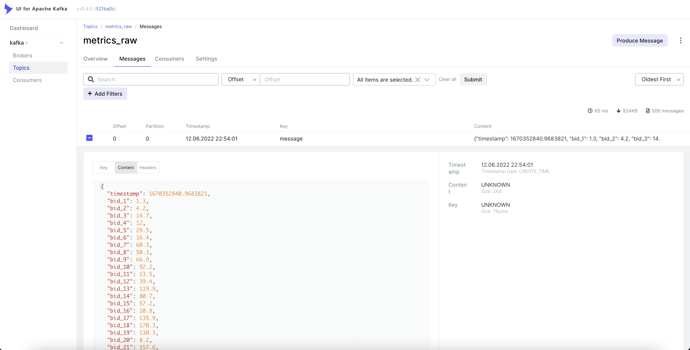
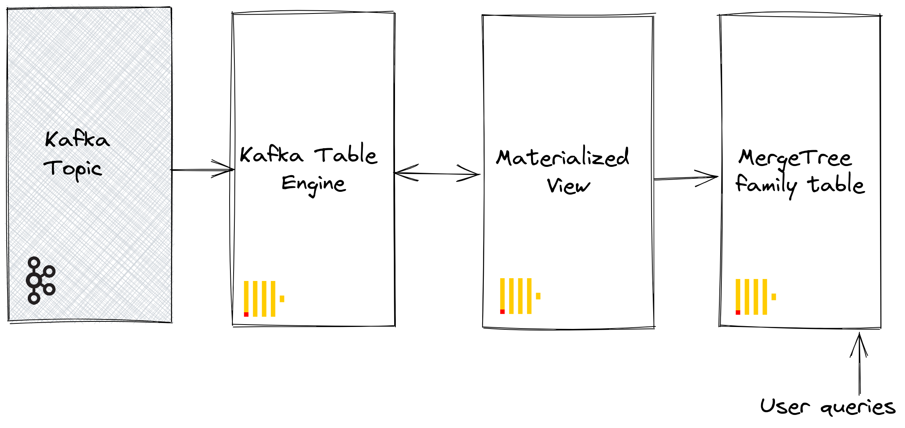
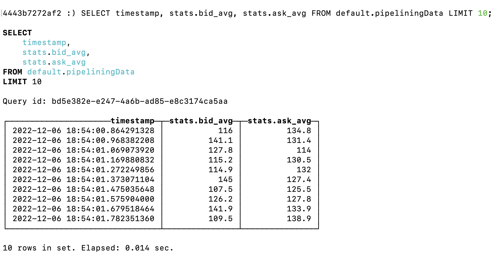
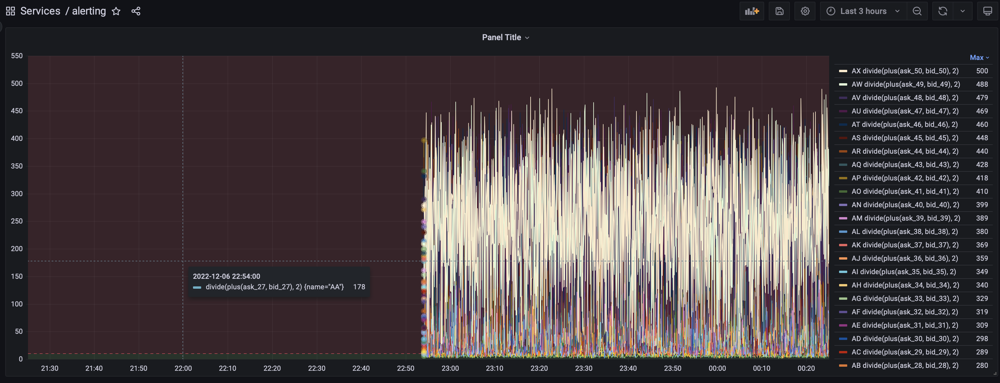

# pipelining-data


##  About this project
This project is a test task for creating a data pipeline. And it is a miniature stand.<br></br>
The project consists of four components:
- A utility written in **python** to generate test data and send it to kafka
- **Apache kafka** based data bus
- **Clickhouse** for data aggregation and storage
- **Grafana** for monitoring and alerting abnormal values
<p align="center">
  
</p>

## Algorithm of operation
1. The **python** service generates data according to the test task and sends it to apache kafka with the interval `CREATE_REPORT_INTERVAL`.
2. **Apache kafka** acts as an intermediate data bus and lines up a queue in front of clickhouse.
3. **Clickhouse** uses the `Kafka engine` to subtract data from kafka and save it to a table with the `MergeTree engine`.
4. **Grafana** fetches BID and ASK data from clickhouse according to the formula `(ask_01 + bid_01) / 2`. The threshold is set to exceed the limit of `9.9`


##  Repository map
```sh
.
├── CHANGELOG.md
├── Dockerfile              ### Manifest for creating a docker image with a python service
├── LICENSE                 ### Information about the project license
├── README.md               ### The file you're reading now
├── doc                     ### Сontent for documentation
├── configs                 ### A set of configurations for clickhouse and grafana
│   ├── clickhouse           ## A set of configurations for clickhouse
│   │   ├── grafana.xml       # Configuration for configuring clickhouse users
│   │   └── init-db.sh        # Script for preparing tables and mapping schemas for storing test data
│   └── grafana              ## A set of configurations for grafana provisioning
│       ├── alerts.json       # Json model of the dashboard
│       ├── dashboard.yaml    # Parameters for provisioning dashboards
│       └── datasource.yaml   # Parameters for provisioning datasources
├── docker-compose.yml      ### Manifest for launching containers with all the services necessary for the project
├── requirements.txt        ### Dependencies for python service
└── src                     ### The source code of the service in python
    ├── data_generator.py    ## Module for generating test data
    ├── kafka_sender.py      ## Module for sending generated data to kafka
    └── main.py              ## The main mod for initializing dependent classes and extracting environment variables
```

##  Requirements
-  Apache kafka + Zookeeper - [queue broker](https://hub.docker.com/r/bitnami/kafka) and [coordinator for kafka](https://hub.docker.com/r/bitnami/zookeeper)
-  Kafka-ui - [UI for data visualization in kafka](https://github.com/provectus/kafka-ui)
-  Clickhouse - [persistent data storage](https://hub.docker.com/r/yandex/clickhouse-server)
-  Grafana - [fetching data from a database for monitoring values](https://hub.docker.com/r/grafana/grafana)


## Environment variables

| Variable  | Service | Description | Default |
| ------------- | ------------- | ------------- | ------------- |
| `ALLOW_ANONYMOUS_LOGIN` | **Zookeeper** | Allows anonymous authorization in zookeeper | `yes` |
| `ALLOW_PLAINTEXT_LISTENER` | **Kafka** | Allow to use the PLAINTEXT listener | `yes` |
| `KAFKA_CFG_ZOOKEEPER_CONNECT` | **Kafka** | Link to Zookeeper server | `zookeeper:2181` |
| `KAFKA_CFG_LISTENERS` | **Kafka** | Allow for remote connections | `PLAINTEXT://:9092` |
| `KAFKA_CFG_ADVERTISED_LISTENERS` | **Kafka** | Link to kafka for the announcement | `PLAINTEXT://kafka:9092` |
| `KAFKA_CLUSTERS_0_NAME` | **kafka-ui** | The name of the kafka cluster to display in webui | `kafka` |
| `KAFKA_CLUSTERS_0_BOOTSTRAPSERVERS` | **kafka-ui** | Link to kafka cluster | `kafka:9092` |
| `GF_INSTALL_PLUGINS` | **grafana** | List of plugins to install when launching a container from grafana | `grafana-clickhouse-datasource` |
| `GF_AUTH_ANONYMOUS_ENABLED` | **grafana** | Allow access to grafana without authorization | `yes` |
| `BID_SIZE` | **pygenerator** | The number of bid elements in the generated data | `50` |
| `ASK_SIZE` | **pygenerator** | The number of ask elements in the generated data | `50` |
| `RANDOM_START` | **pygenerator** | From what number does the range start for random generation of values in bid and ask elements | `1` |
| `RANDOM_DECIMAL` | **pygenerator** | The accuracy of the blown float values from random generation for bid and ask elements | `1` |
| `CREATE_REPORT_INTERVAL` | **pygenerator** | Pause between report generation iterations | `0.1` in seconds |
| `KAFKA_BOOTSTRAP_SERVERS` | **pygenerator** | Kafka cluster for transmitting generated data | `kafka:9092` |
| `KAFKA_TOPIC` | **pygenerator** | The name of the kafka topic for transmitting the generated data | `metrics_raw` |


##  How to run with docker-compose
1. Building and launching of all necessary services
```sh
docker-compose up -d
```
2. Viewing logs
```sh
docker logs -f pygenerator
```

##  Description of components and important parts
### Python service
Additional external modules are required for the service to work in python:
- [kafka-python](https://kafka-python.readthedocs.io/en/master/) to send the generated data to kafka
- [logger-package](https://github.com/obervinov/logger-package) to log the service operation process

The source code of the service consists of three separate modules:
- [data_generator.py](src/data_generator.py) This module is responsible for generating report data according to the test task
- [kafka_sender.py](src/kafka_sender.py) This module is responsible for initializing the connection with kafka and sending the report data to the topic
- [main.py](src/main.py) The main module of the service, it is also an entrypoint. Initializes the classes of modules specified earlier and defines environment variables.
### Apache Kafka
Receives data from the python service and lines up queues in front of the database.

Nothing interesting.

You can view incoming messages via kafka-ui here: http://0.0.0.0:8080/ui/clusters/kafka/topics/metrics_raw
<p align="center">
  
</p>

### Clickhouse
Reading data from Kafka and further saving to the database is implemented according to the [official documentation](https://clickhouse.com/docs/en/integrations/kafka/kafka-table-engine/)

[The initdb shell script](configs/clickhouse/init-db.sh) is used to configure the clickhouse:
- Creating a `pipeliningData_queue` table on the `Kafka engine` to read data from the kafka topic
- Creating a `pipeliningData` table for permanent storage of read data on the `MergeTree engine`
- Creating a `MATERIALIZED VIEW` `pipeliningData_mv` to fetch data from `pipeliningData_queue` to `pipeliningData`
<p align="center">
  
</p>

[The configuration file](configs/clickhouse/grafana.xml) for creating a separate user that graphana will use:
- Creating a user
- Creating a role for the created user
<p align="center">
  
</p>

### Grafana
The grafana is needed in this project to build monitoring based on data stored in clickhouse.

A graph that is already ready for operation is configured using [provisioning](https://grafana.com/docs/grafana/latest/administration/provisioning/):
- [Configuration of datasource provisioning](configs/grafana/datasource.yaml)
- [Configuration of dashboard provisioning](configs/grafana/dashboard.yaml)
- [Json model of the finished dashboard](configs/grafana/alerts.json)

The url of the grafana that is available after launching all services in docker-compose: http://0.0.0.0:3000
**Attention, charting may take several minutes!**
<p align="center">
  
</p>

##  How to build a docker image with a python service
```sh
export APP_VERSION=v1.0.0
export APP_NAME="pipelining-data"
docker build -t ghcr.io/${GITHUB_USERNAME}/${APP_NAME}:${APP_VERSION} .
docker push ghcr.io/${GITHUB_USERNAME}/${APP_NAME}:${APP_VERSION}
```
